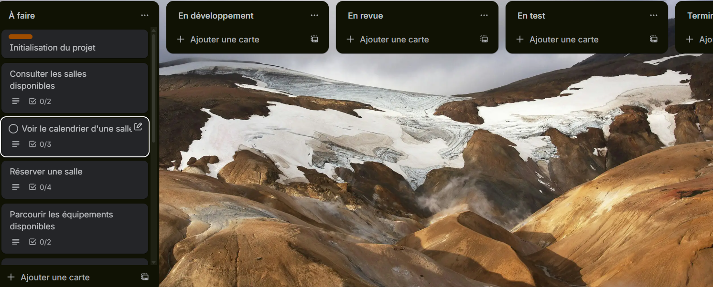
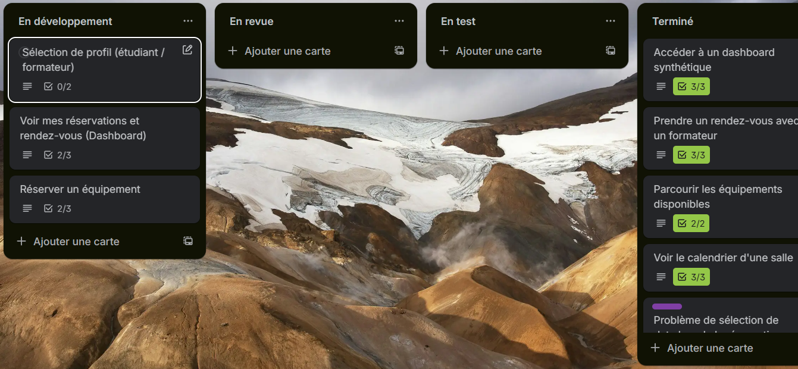
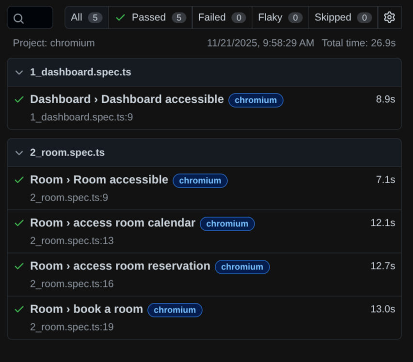
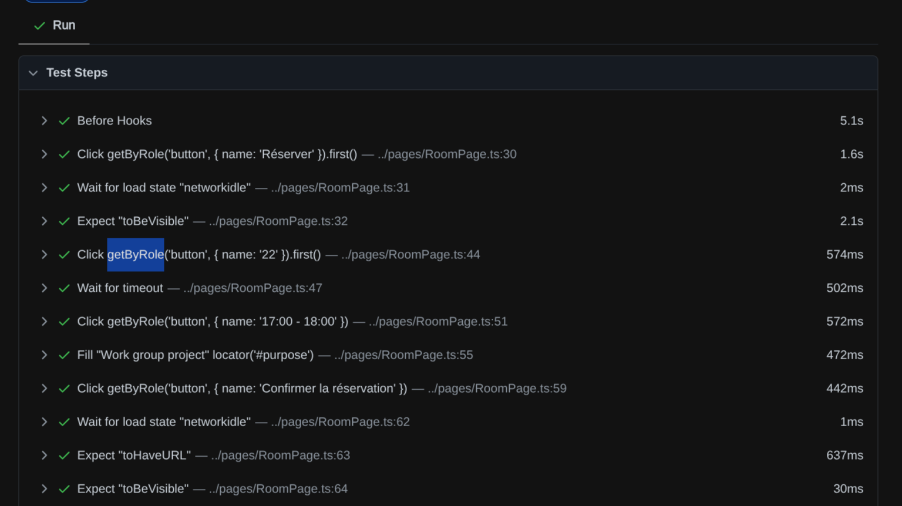

# LIVRABLE – Campus Book

## 1. Identité & Contexte
- **Équipe :** Les Poches Tronc  
- **Client :** Les Dragon Anonyme  
- **Nom du projet :** Campus Book  
- **Objectif :** centraliser la réservation de salles, l’emprunt d’équipements et la prise de rendez-vous enseignants dans une interface unique, simple et rapide, afin de fluidifier la gestion des ressources du campus et réduire les frictions liées aux outils disparates.

## 2. Organisation & Rôles
| Membre  | Rôles cumulés | Responsabilités clés |
|---------|---------------|----------------------|
| Ewen    | PO · Dev      | Priorisation produit, implémentations front/back, relecture code |
| Lucas   | PM · Testeur  | Relation client, suivi planning/Kanban, validation qualité fonctionnelle |
| Tristan | Dev           | Développement fonctionnalités, intégration CI |
| Damien  | Testeur       | Plans de tests IHM, exécution et analyse des campagnes |

## 3. Expression du besoin
- Offrir **une interface unifiée** pour les salles, équipements et rendez-vous afin d’éviter les formulaires papier et emails multiples.
- Garantir **rapidité et simplicité d’usage**  pour encourager l’adoption.
- **Synchroniser toutes les réservations** dans un espace utilisateur unique (historique + actions).
- Assurer **transparence sur la disponibilité** des ressources et des créneaux à venir.

## 4. Exigences fonctionnelles (synthèse)
1. **Salles** : liste complète avec nom/capacité, réservation par créneau, validation disponibilité, calendrier global (`EXIG-FONC-01` à `04`).
2. **Équipements** : catalogue, description, durée maximale, statut disponible/emprunté, réservation via formulaire et suivi (`EXIG-FONC-05` à `08`).
3. **Enseignants** : annuaire + disponibilités sous forme d’agenda, réservation/annulation de créneau (`EXIG-FONC-09` à `12`).
4. **Espace utilisateur** : historique, réservations futures, opérations de modification/annulation contrôlées (`EXIG-FONC-13` à `15`).
5. **Dashboard** : vision synthétique des salles et équipements libres + prochains créneaux enseignants (`EXIG-FONC-16` à `18`).

## 5. Exigences non fonctionnelles
- Données factices mais cohérentes (`EXIG-NF-01`), pas d’authentification complexe (sélection profil) (`EXIG-NF-02`), pas de workflows de validation avancés (`EXIG-NF-03`).
- Interface intuitive, temps de chargement courts, respect de l’accessibilité de base (`EXIG-NF-04` à `06`).
- Code maintenable et versionné Git, aucune donnée personnelle sensible stockée (`EXIG-NF-07` à `08`).

## 6. User Stories clés
| ID | Résumé | Critères d’acceptation majeurs |
|----|--------|-------------------------------|
| US1 | Consulter les salles disponibles | Liste exhaustive affichée < 2 s, nom + capacité, cohérente avec dataset |
| US2 | Réserver une salle | Sélection d’un créneau libre, validation automatique disponibilité, message d’erreur si conflit, trace dans l’espace utilisateur |
| US3 | Voir le calendrier d’une salle | Vue jour/semaine, créneaux réservés visibles, calendrier synchro après nouvelle réservation |
| US4 | Parcourir les équipements | Carte détaillée (nom, description, durée max, disponibilité) alignée sur dataset, statut emprunté explicite |
| US5 | Réserver un équipement | Formulaire simple, validation disponibilité, apparition dans l’historique, blocage en cas d’indispo |
| US6 | Prendre rendez-vous avec un enseignant | Liste des enseignants, créneaux libres affichés, blocage du créneau réservé, annulation libère l’horaire si autorisé |
| US7 | Voir mes réservations (Dashboard perso) | Historique complet + réservations futures, actions de modification/annulation selon règles |
| US8 | Accéder à un dashboard synthétique | Vue agrégée des salles/équipements disponibles et prochains créneaux enseignants |

## 7. Plan de tests IHM & BeB
Chaque US dispose d’un double filet de sécurité : scénarios IHM (manuels guidés) et tests BeB formalisés en Gherkin pour préparer l’automatisation.

### US1 — Consulter les salles disponibles
| ID | Étape utilisateur | Résultat attendu |
|-----|------------------|------------------|
| US1-IHM-01 | Ouvrir la page « Salles disponibles » | Chargement < 2 s |
| US1-IHM-02 | Observer la liste | Nom + capacité visibles |
| US1-IHM-03 | Comparer au dataset | Données cohérentes |
| US1-IHM-04 | Actualiser la page | Affichage stable |

```
Feature: Consultation des salles disponibles
  Scenario: Affichage correct
    When l’utilisateur ouvre la page des salles disponibles
    Then la liste s’affiche avec nom et capacité
    And les données sont cohérentes avec le dataset
    And la page se charge en moins de 2 secondes
```

### US2 — Réserver une salle
| ID | Étape | Résultat attendu |
|-----|------|------------------|
| US2-IHM-01 | Sélectionner une salle | Détails visibles |
| US2-IHM-02 | Choisir un créneau libre | Créneau sélectionné |
| US2-IHM-03 | Confirmer | Réservation validée |
| US2-IHM-04 | Ouvrir espace utilisateur | Réservation listée |
| US2-IHM-05 | Tester un créneau réservé | Message d’erreur |

```
Feature: Réservation de salle
  Scenario: Créneau disponible
    Given un créneau libre
    When l’utilisateur tente de le réserver
    Then la réservation est validée
    And elle apparaît dans son espace utilisateur

  Scenario: Créneau non disponible
    Given un créneau déjà réservé
    When l’utilisateur tente de le réserver
    Then un message d’erreur est affiché
```

### US3 — Voir le calendrier d’une salle
| ID | Action | Résultat attendu |
|-----|--------|------------------|
| US3-IHM-01 | Ouvrir la salle | Page salle affichée |
| US3-IHM-02 | Ouvrir « Calendrier » | Vue jour/semaine |
| US3-IHM-03 | Vérifier les créneaux | Réservations visibles |
| US3-IHM-04 | Revenir après nouvelle résa | Calendrier synchronisé |

```
Feature: Consultation du calendrier d'une salle
  Scenario: Affichage des créneaux
    When l’utilisateur consulte le calendrier
    Then la vue jour/semaine est affichée
    And les créneaux réservés apparaissent

  Scenario: Données synchronisées
    Given une réservation vient d’être effectuée
    When l’utilisateur retourne au calendrier
    Then les données sont mises à jour
```

### US4 — Parcourir les équipements
| ID | Action | Résultat attendu |
|-----|--------|------------------|
| US4-IHM-01 | Ouvrir la page équipements | Page affichée |
| US4-IHM-02 | Observer un équipement | Nom + description + dispo + durée max |
| US4-IHM-03 | Comparer dataset | Cohérence vérifiée |
| US4-IHM-04 | Vérifier équipement utilisé | Statut « emprunté » visible |

```
Feature: Catalogue des équipements
  Scenario: Affichage complet du catalogue
    When l’utilisateur ouvre la page des équipements
    Then chaque équipement affiche nom, description, durée maximale et disponibilité
```

### US5 — Réserver un équipement
| ID | Action | Résultat attendu |
|-----|--------|------------------|
| US5-IHM-01 | Cliquer sur un équipement disponible | Fiche visible |
| US5-IHM-02 | Remplir le formulaire | Validation ok |
| US5-IHM-03 | Confirmer | Réservation enregistrée |
| US5-IHM-04 | Ouvrir espace utilisateur | Réservation visible |
| US5-IHM-05 | Tester équipement non dispo | Message d’erreur |

```
Feature: Réservation d’un équipement
  Scenario: Équipement disponible
    Given un équipement disponible
    When l’utilisateur complète le formulaire
    Then la réservation est enregistrée
    And elle apparaît dans l’historique utilisateur

  Scenario: Équipement indisponible
    Given un équipement déjà emprunté
    When l’utilisateur tente de le réserver
    Then une erreur est affichée
```

### US6 — Prendre rendez-vous avec un enseignant
| ID | Action | Résultat attendu |
|-----|--------|------------------|
| US6-IHM-01 | Ouvrir la page enseignants | Liste visible |
| US6-IHM-02 | Ouvrir un enseignant | Créneaux affichés |
| US6-IHM-03 | Sélectionner créneau libre | Sélection confirmée |
| US6-IHM-04 | Confirmer RDV | Réservation validée |
| US6-IHM-05 | Vérifier le créneau | Devient indisponible |
| US6-IHM-06 | Tester annulation autorisée | Créneau libéré |

```
Feature: Prise de rendez-vous avec un enseignant
  Scenario: Réserver un créneau libre
    Given un enseignant avec un créneau libre
    When l’utilisateur sélectionne le créneau
    Then le rendez-vous est réservé
    And le créneau devient indisponible

  Scenario: Annulation autorisée
    Given un rendez-vous existant
    When l’utilisateur l’annule
    Then le créneau redevient disponible
```

### US7 — Voir mes réservations
| ID | Action | Résultat attendu |
|-----|--------|------------------|
| US7-IHM-01 | Ouvrir l’espace utilisateur | Page affichée |
| US7-IHM-02 | Vérifier l’historique | Historique complet |
| US7-IHM-03 | Vérifier réservations futures | Liste à venir visible |
| US7-IHM-04 | Tester modification/annulation | Action acceptée si autorisée |

```
Feature: Consultation de l’espace utilisateur
  Scenario: Afficher les réservations
    When l’utilisateur ouvre son espace personnel
    Then l’historique complet apparaît
    And les réservations futures sont affichées
```

### US8 — Dashboard synthétique
| ID | Action | Résultat attendu |
|-----|--------|------------------|
| US8-IHM-01 | Ouvrir le dashboard | Vue synthétique visible |
| US8-IHM-02 | Vérifier section salles | Salles disponibles listées |
| US8-IHM-03 | Vérifier section équipements | Équipements disponibles listés |
| US8-IHM-04 | Vérifier créneaux enseignants | Prochains créneaux affichés |

```
Feature: Dashboard synthétique
  Scenario: Affichage des ressources
    When l’utilisateur ouvre le dashboard
    Then les salles disponibles sont affichées
    And les équipements disponibles sont affichés
    And les prochains créneaux libres des enseignants sont affichés
```

## 8. Rapports produits (workflow DEV)
| Étape DEV (consignes) | Rapport / livrable produit | Points clés |
|-----------------------|----------------------------|-------------|
| 2a-2c · Organisation initiale | Fiche de répartition des rôles (§2) + note d’onboarding BO/DEV | Attribution PO/PM/Dev/Test validée avec le client |
| 2d · Définition des US + Kanban | `US.md` + backlog priorisé + Kanban (photo à insérer §10) | US1→US8 décrites + critères d’acceptation, workflow partagé |
| 2e · Revue / Raffinage des US | Compte rendu Raffinement Sprint 0 (Notion) | Ajustement des capacités salles & règles d’annulation |
| 2f · Plans de tests IHM + BeB | Plan détaillé (§7) + scénarios Gherkin | Couverture complète des parcours utilisateur |
| 2g · Revue du plan de test | Checklist QA signée par Damien (Annexe QA-01) | Validé côté testeurs avant dev |
| 2h · Développement + TU | Journal de build + PR #CampusBook/42 + `npm run test` | Implémentations + couverture des helpers/dashboard/store |
| 2i · Exécution des tests | Rapport Vitest 20/11/2025 + logs Playwright (shards 1/6, 2/6) | 24 tests unitaires OK, e2e fumée verte |
| 2j · Analyse & rapport de test | Synthèse QA Sprint 1 (Lucas) + tableau anomalies | 0 critique, 2 suggestions UX (messages d’erreur, contraste) |
| 2k · Bilan / REX | REX Sprint 1 (atelier 30 min) | Actions : renforcer accessibilité, compléter dataset enseignants |
| 2l · Démonstration & livraison | Script de démo + ce livrable (MD + PDF) servant de Bon de Livraison | Scénario client validé, en attente d’ajout photos Kanban |
| 2m · Stratégie d’automatisation | Action composite GitHub + backlog d’évolutions (cf. §10) | Déploiement CI unifié, sharding Playwright à étendre |

Tous les rapports sont archivés dans le dossier `docs/` du dépôt (ou Notion partagé) et référencés dans le tableau ci-dessus pour faciliter l’audit qualité.

## 9. Résultats QA & analyses
1. **Vision humaine**  
   - Les parcours critiques ont été rejoués manuellement lors des revues de sprint en suivant les scripts IHM ci-dessus. Aucun blocage fonctionnel n’a été constaté ; seules des améliorations UX mineures (microcopie des erreurs, contraste) restent ouvertes.  
   - Les données fictives sont alignées sur les exigences : cohérence croisée salle/calendrier/dashboard vérifiée par comparaison dataset vs rendu (US1-US4).  
2. **Tests unitaires (Vitest)**  
   - Exécution `npm run test` du 20/11/2025 à 10:39: 6 fichiers, 24 tests, 100 % succès (611 ms).  
   - Couverture logique : calculs dashboard (`tests/unit/dashboard.test.ts`), helpers planning (`tests/unit/scheduling.test.ts`), validation formulaire (`tests/unit/validation.test.ts`), mock data (`tests/unit/mock-data.test.ts`), store client (`tests/unit/store.test.ts`), notifications (`tests/unit/toast-reducer.test.ts`).  
3. **Analyse des résultats**  
   - Les suites unitaires capturent les règles de disponibilité (chevauchements, créneaux futurs, statut équipement) et les comportements d’état, réduisant les régressions sur les parcours US1–US8.  
   - Les scripts IHM/BeB mettent en avant les cas limites restants (annulation RDV conditionnelle, transition « emprunté » → « disponible »). Ces scénarios sont planifiés pour une automatisation Playwright progressive (cf. §10).  
   - Risques suivis : montée en charge lors de pics de réservation (nécessite tests de performance), accessibilité (audit manuel à renforcer), complétion du sharding e2e.

## 10. Workflow, Kanban & automatisation
### Kanban & suivi visuel
- Photo du Kanban **début du process** : 
- Photo du Kanban **fin du process** : 
- Workflow opérationnel : Backlog → Raffinage → Dev en cours → Tests → Prêt démo → Done (piloté par Lucas côté PM, synchronisé avec jalons QA hebdo).
- Rapport de test playwright : 
test : book à room 
 

### Automatisation CI/CD
- **Action composite GitHub** `.github/actions/run-playwright-tests/action.yml` :
  1. Prépare les dossiers de sortie (`playwright-report`, `blob-report`, `screenshots`).  
  2. Exécute `npm run test` pour lancer la suite Vitest.  
  3. Lance les tests Playwright par shard (`1/6`, `2/6`, …) afin de paralléliser les spécifications e2e.  
- **Portée actuelle** :
  - **Unitaires** : logique métier de disponibilité (dashboard, scheduling), gestion d’état (toast reducer), validation (formulaires).
  - **E2E (Playwright)** : parcours dashboard + réservation salle (shards 1 et 2).  
- **Évolutions prévues** : ajouter les shards `3/6` à `6/6`, publier les rapports Playwright en artefacts CI, automatiser l’injection du dataset de démo avant chaque run et intégrer les scénarios Gherkin restants.

## Conclusion & suites proposées
- Campus Book répond désormais aux exigences BO/DEV : vision claire, US priorisées, plan de test exhaustif et automatisation amorcée garantissent un MVP fiable.
- Les rapports produits (étapes 2a→2m) et les résultats QA (24 tests unitaires verts, parcours manuels validés) apportent la transparence attendue par Les Dragon Anonyme.
- Prochaines actions recommandées : finaliser le sharding Playwright, intégrer les scénarios Gherkin restants, renforcer l’accessibilité et ajouter les photos Kanban au livrable avant la démo finale.

